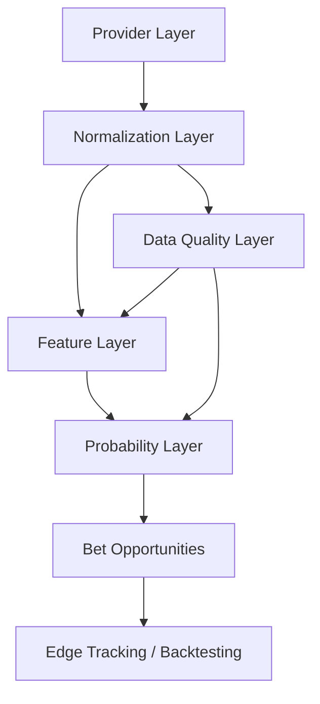

# Provider Layer Foundation v10

## Current dependency map

| Area | Current source | Data kind | Coupling risk |
| --- | --- | --- | --- |
| Dashboard matches | Prisma seed data via `src/lib/data.ts` | Mixed real/demo | Medium: UI reads Prisma shape directly. |
| CS2 teams and rosters | `src/lib/cs2RealData.ts` HLTV manual snapshot | Real snapshot | Low: static data can be normalized by providers. |
| CS2 team ratings | `cs2RealData` consumed in `matchIntelligence.ts` | Real snapshot with fallback | Medium: scoring reads the snapshot helper directly. |
| CS2 maps, CT/T, H2H, player kills | Generated in `matchIntelligence.ts` | Demo/fallback | High: factors are created inside feature logic. |
| Dota 2 form | `opendotaProvider.ts` inside `matchIntelligence.ts` | Real API when available | Medium: direct provider call in feature logic. |
| Odds and line movement | Prisma seed snapshots | Demo | Medium: edge finder reads Prisma odds snapshots directly. |
| Football context | Prisma seed externalIds plus fallback logic | Real schedule context + demo factors | Medium: normalization not yet separated. |
| Data quality | `dataQuality.ts` from EdgeFeature source labels | Derived | Low: source labels already map to real/demo/fallback/missing. |
| Edge Tracking | Prisma `EdgeTrackingEntry` | Product data | Low: tracks normalized edge fields, not provider fields. |

## Target architecture

## Provider contracts added

- `TeamProvider`
- `PlayerProvider`
- `MatchProvider`
- `MapProvider`
- `OddsProvider`
- `TournamentProvider`

Each provider returns `ProviderResult<T>` with normalized data, source provenance, quality metadata, and warnings.

## Normalized entities

- `NormalizedTeam`
- `NormalizedPlayer`
- `NormalizedMatch`
- `NormalizedMap`
- `NormalizedTournament`
- `NormalizedOddsSnapshot`

These are intentionally independent from Prisma and from any vendor response format.

## Data source registry

Current registry entries:

- `Liquipedia`
- `HLTV Snapshot`
- `GRID`
- `PandaScore`
- `BALLDONTLIE`
- `Demo`
- `Fallback`

Each entry stores `providerName`, `reliabilityScore`, `freshness`, `coverage`, `costTier`, `sourceType`, capabilities, production readiness, and notes.

## Implemented foundation providers

### HLTV Snapshot Provider

Uses only current project data from `src/lib/cs2RealData.ts`.

Provides:

- teams;
- players/rosters;
- matches;
- rankings.

Does not provide:

- map pool;
- veto;
- player match logs;
- K/D;
- ADR;
- average kills.

### Liquipedia Snapshot Provider

Uses only current project data from `src/lib/cs2RealData.ts`.

Provides:

- tournament context;
- tournament matches.

Does not provide:

- live schedule sync;
- maps;
- veto;
- player stats.

## Probability Core compatibility

`src/lib/providers/probabilityCompatibility.ts` converts provider results into `EdgeFeature[]` snapshots and calculates `DataQualityScore`.

This means future `Feature Layer` code can consume provider data without knowing whether the source is GRID, PandaScore, BALLDONTLIE, Liquipedia, HLTV Snapshot, Demo, or Fallback.

## Replacement risk

Replacing a provider should not affect:

- `probabilityCore.ts`;
- `dataQuality.ts`;
- `edgeTracking.ts`;
- `EdgeTrackingEntry` storage shape.

Still coupled and should be migrated later:

- `matchIntelligence.ts` directly creates demo/fallback maps, H2H, players and football factors.
- `edgeFinder.ts` reads `MatchIntelligence` instead of a normalized feature bundle.
- `data.ts` returns Prisma records directly to pages.

## Can we build first Real Map Edge with Liquipedia + HLTV?

Not fully.

Liquipedia + HLTV snapshot can support real match identity, tournament context, team identity, rosters, and rankings. That is enough for a real `Team/Tournament Edge`, but not enough for a real `Map Edge`.

For a real Map Edge we still need at least:

- map pool;
- map winrate;
- recent map history;
- veto probability or veto history.

Those can be added later through GRID, PandaScore, BALLDONTLIE if entitlement covers it, or a manual HLTV/Liquipedia snapshot ingestion flow.
